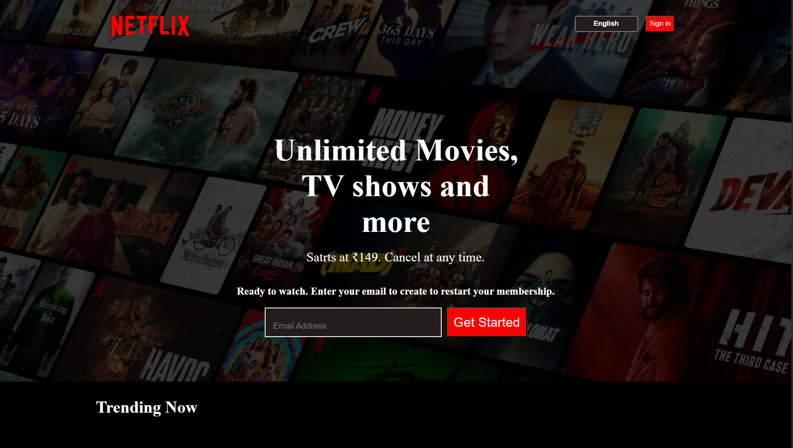

# 🎬 Netflix Clone

A responsive and visually engaging Netflix homepage clone built with **HTML**, **CSS**, and **Vanilla JavaScript**. This project replicates the UI/UX of Netflix's landing page, including a hero section, trending carousel, and footer — complete with custom styling and images.

---

## 🚀 Live Demo

🌐 [View on Netlify](https://aryandev-namealreadytaken.netlify.app/)

---

## 📺 Preview



---

## 📂 Folder Structure
```
📁 Netflix-Clone/
├── 📄 index.html
├── 📄 style.css
├── 📁 assets/
│ └── 📁 images/
│ ├── bg.jpg
│ ├── logo.svg
│ ├── favicon.ico
│ └── (various movie poster images)
```

---

## ✨ Features

- 🎥 Hero section with background image and call-to-action
- 🎞️ Horizontal scroll section for trending movies
- 📱 Responsive design for all devices
- 🔒 Favicon support (visible in the browser tab)
- 🧒 Kids’ profile section simulation
- ❓ Frequently Asked Questions section
- 📩 Email form section

---

## 🛠️ Tech Stack

- **HTML5**
- **CSS3**
- **Vanilla JavaScript** (basic interactivity)
- **Responsive Design**

---

## 🧠 Learning Outcomes

- Mastered layout creation using Flexbox
- Practiced UI cloning with pixel perfection
- Enhanced responsive design skills
- Hands-on use of `background-blend-mode`, `overflow-x`, and clean layout styling

---

## 💡 Improvements for Future

- Add interactive FAQs with toggle logic using JavaScript
- Include dark/light theme toggle
- Add routing (multi-page support) using frameworks
- Use a JSON API to populate movie cards dynamically

---

## 📬 Connect With Me

👤 **Aryan Singh**  
🔗 • [LinkedIn](https://www.linkedin.com/in/aryansingh006/) • [GitHub](https://github.com/singharyan006/)

---

## 📄 License

This project is for educational purposes only. All images and assets are used for demo and learning. No commercial use intended.

